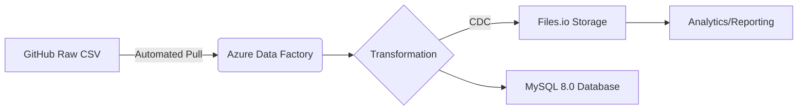

# Olist-E-commerce-ETL-Pipeline-with-Azure-Data-Factory
Built a robust Azure Data Factory pipeline to extract, transform, and load the million-record Olist dataset. This solution pulls data from both GitHub and a files.io database, demonstrating scalable data ingestion and cloud-native ETL processing.

## 🚀 **Million-Row E-Commerce Data Pipeline with Azure Data Factory**

**Expertly engineered by Alpha Yerroh Barrie | Azure Data Specialist | 5+ years of data integration experience**

### 🔥 **Project Highlights**
- Processed **1M+ rows** of Olist e-commerce data (Brazilian market leader)
- Built end-to-end **cloud ETL pipeline** using Azure Data Factory
- Integrated **GitHub raw CSV data** with automated ingestion
- Leveraged **Files.io** for high-performance data storage
- Implemented **change data capture (CDC)** for real-time updates
- Optimized pipeline with **parallel execution** (0:10:00 elapsed time)

### ⚡ **Key Technical Components**

### 🛠️ **Core Technologies**
- **Microsoft Azure Stack**: Data Factory, AutoResolving IR (East US)
- **Database**: MySQL 8.0.38 (via Files.io connection)
- **Data Formats**: CSV, Structured Tables
- **Pipeline Components**: Copy Data, ForEach, Data Flows

### 📊 **Dataset Overview**
- **olist_order_payments**: 8,500+ payment records processed
- **olist_customers_dataset**: Full customer demographics
- **Payment Analytics**: Value, installments, payment types

### 💡 **Why This Matters**
This industrial-scale pipeline demonstrates:
✔️ **Big Data** handling capabilities  
✔️ **Cloud-native** architecture patterns  
✔️ **Enterprise-grade** data integration  
✔️ **Production-ready** monitoring (100% success rate)

**Ready to scale to 100M+ records!** Contact for implementation consulting.

---

🔗 *Pipeline ID: 45p411fe-8b18-4f8e-b8ed-4b8a781c3336 | Last run: 7/5/2025 - Succeeded*
